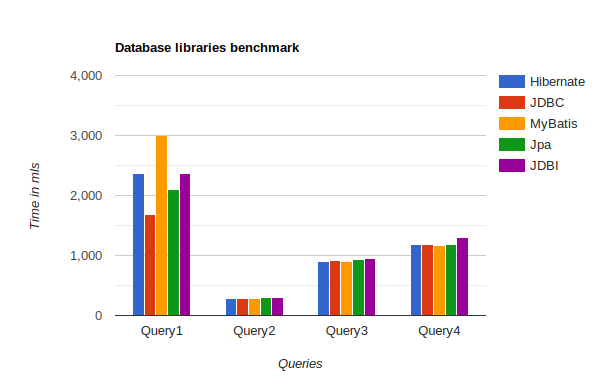

# Java Database Libraries Test
В данном проекте будут протестировны 5 самых популярных библиотек для работы с базами данных:
- [Jpa (Hibernate impl)](https://hibernate.org/orm/)
- [Hibernate](https://hibernate.org/orm/)
- [MyBatis](https://mybatis.org/mybatis-3/)
- [JDBI](https://jdbi.org/)
- [JDBC](https://docs.oracle.com/javase/8/docs/technotes/guides/jdbc/)

### Dataset
Данные можно скачать [тут](https://drive.google.com/file/d/1XWCk4XmgdNUZ8E42ktjGpeeKZeTO9YnJ/view?usp=drive_link). 2 миллиона строк о заказах такси в New York'е.

### Запрос
- Первый запрос
```sql
    SELECT VendorID, count(*) 
    FROM taxi 
    GROUP BY 1
```
- Второй запрос
```sql
    SELECT passenger_count, avg(total_amount) 
    FROM taxi 
    GROUP BY 1
```
- Третий запрос
```sql
    SELECT 
        passenger_count,
        extract(year from tpep_pickup_datetime),
        count(*)
    FROM taxi
    GROUP BY 1, 2;
```
- Четвертый запрос
```sql
    SELECT
        passenger_count,
        extract(year from tpep_pickup_datetime),
        round(trip_distance),
        count(*) 
    FROM taxi
    GROUP BY 1, 2, 3
    ORDER BY 2, 4 desc;
```

## Запуск
Запустить проект можно через среду разработки IntelliJ IDEA.

## Сравнение


Такие решения для работы с БД как Hibernate, Jpa, MyBatis поддерживают множество сильно упрощаю разработку
функциональностей, например ORM, но замедляющих выполнение кода, однако из-за специфики запросов в последних
трех библиотеки показывают одинаковые результаты. 

В первом запросе результат групируется по столбцу VendorID, так он всегда уникален происходит сравнение всех строк со всеми,
что сильно сказывается на выполнение. В итоге мы получаем 2 миллиона строк результата. Так как jdbc самая 
низко уровневая реализация api для работы с бд на таком объёме данных показывает лучший результат. Jpa использует
Hibernate под капотом, поэтому их результаты не должны сильно отличается, на различие могло повлиять кэширование.
Hibernate и JDBI показали себя одинаково, однако используют разные подходы. Hibernate, является ORM системой и работает
через связку полей сущности (в нашем случае [TaxiOrder](src/main/kotlin/entity/TaxiOrder.kt)) и столбцов в таблице,
данные преобразования занимают существенное время, так же осложняют работу если запрос возвращает не сущность, как в 
наших запросах. JDBI не является ORM системой, поэтому результатом запросов является список словарей, в которых ключ это 
название столбца. Все библиотеки в данном сравнение используют JDBC, который возвращает ResultSet, поэтому в случае jdbi
ему требуется преобразовать его в мапу, что занимает какое-то время. MyBatis связывает столбцы запроса и поля возвращемого
класса, если класс является JavaBean, то что бы преобразовать ResultSet дополнительных уточнений не требуется.

## Послевкусие библиотек
### Hibernate
Hibernate - самая популярная библиотека объектно-реляционного отображения (ORM) для языка программированния Java. Так
же самый широко используемый фреймворк для backend-разработки Spring реализует работу с базой данных через Hibernate. Hibernate 
предоставляет широкий спектр функциональности от не посредственно запросов к бд и маппинга результата до валидации и 
кэширования. Благодаря простому управлению транзакциями выполнять модифицирующие запросы довольно приятно. Не сложная
настройка сущности через аннотации позволяет легко адаптировать ее под либую сложность отношений между таблицами. 
Все исключение являются непроверяемые поэтому код не загрязняется тоннами try/catch.

## JPA
Jpa - это по-сути спецификация API от Spring. В нашем случае мы используем ее реализацию от Hibernate, работа с jpa 
мало чем отличается от Hibernate однако не которая оптимизация под капотом иногда позволяет добиться ускорения исполнения.

## JDBC
JDBC - базовое API для работы с бд поставляемое с 1997 года. JDBC API состоит из ряда классов и интерфейсов, написанных на языке программирования Java, они предоставляют ряд методов для обновления и запроса данных в базе данных. Это драйвер, ориентированный на  реляционную базу данных. Это позволяет java-приложению повторно использовать подключение к базе данных, которое уже было создано, вместо создания нового соединения. Сильно уступает другим, отсутствует потокобезопасность, потому что создание нескольких connection в разных потоках приводить к непредсказуемому поведению. Нет поддержки Lazy Loading, поэтому придется подгружать данные частями руками. Ручное управление транзакциями, маппинг к объекту осложняют разработку. 

## JDBI
jDBI - это удобная библиотека, созданная поверх JDBC. JDBC работает очень хорошо, но в целом, похоже,
оптимизируется для поставщиков баз данных (авторов драйверов), а не для пользователей.
jDBI пытается предоставить ту же функциональность, но в API оптимизированном для пользователей.
Это гораздо более низкий уровень, чем предыдущие библиотеки. Весьма удобный api для создания запросов, можно писать в 
стиле chained invocation. Новая функциональность для работы через кастомный интерфейс и аннотации, делает архитектуру
приложение сильно чище.

## MyBatis
MyBatis - библиотека от Apache ля работы с базами данных. Мое предпочтение между данными библиотеками.
Хорошая документация на официальном сайте. Сохраняет одновременно и низкоуровневость, как у jdbi и jdbc, 
и абстракцию выше чем у Hibernate. MyBatis так же как и Hibernate является ORM фреймворком, однако с противоположным подходом.
Вместо связывания полей объекта со столбцами таблицы, что ограничивает запросы, связывает поля объекта со столбцам запроса.
Что дает возможность возвращать не только экземпляры одного класса или просто список не определенных объектов, а различные
объекты определенные пользователем, маппинг под которых происходит автоматически, если класс написан по стандарту JavaBean.

